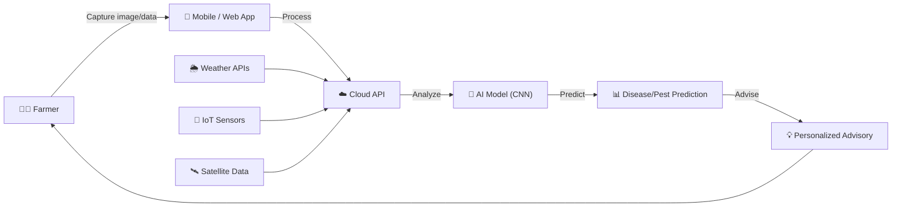
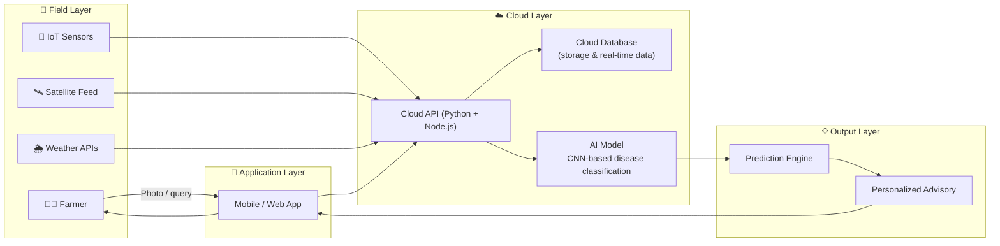

# 🌱 AgriVerse — Smart Pest & Disease Forecasting for Resilient Agriculture

> AI-driven pest & disease forecasting using weather, IoT, and remote sensing for early detection, precision management, and sustainable crop protection.

**Built for:** Pune Agri Hackathon 2026
**Problem Statement:** Plant Protection — Pest and Disease Forecasting & Management
**Team:** AgriVerse

---

## 📖 Table of Contents

- [Overview](#-overview)
- [The Problem](#-the-problem)
- [Our Solution](#-our-solution)
- [Technical Approach](#-technical-approach)
- [System Architecture](#-system-architecture)
- [Expected Performance & Impact](#-expected-performance--impact)
- [Feasibility & Viability](#-feasibility--viability)
- [Cost Estimation](#-cost-estimation)
- [Competitive Landscape](#-competitive-landscape)
- [Impact & Benefits](#-impact--benefits)
- [Research & References](#-research--references)
- [Team](#-team)
- [Documentation](#-documentation)

---

## 🔎 Overview

Traditional farming relies on **reactive** pest and disease management — by the time a farmer spots the problem, crop damage has already begun. AgriVerse flips this model by fusing **image-based AI, IoT sensor data, weather history, and satellite feeds** into a single forecasting engine that warns farmers *before* an outbreak happens, not after.

Read the full narrative in [`docs/CASE_STUDY.md`](docs/CASE_STUDY.md).

## 🚨 The Problem

| Threat | Why it matters |
|---|---|
| 30–40% of crops are lost every year to pests & diseases | Direct hit to farmer income and food security |
| Farmers receive no early warning before outbreaks | Damage is discovered only after it's visible |
| Climate change makes pest attacks unpredictable | Historical patterns alone are no longer reliable |
| Excess pesticide use increases cost and damages soil | Blanket spraying instead of targeted treatment |
| No real-time forecasting tools exist at the farmer level | Advisory is generic, not location- or crop-stage-specific |

## ✅ Our Solution

| Threat | AgriVerse Solution |
|---|---|
| Crop losses from pests & diseases | AI-based early detection and prediction system for timely alerts |
| No early warning | Real-time mobile advisory alerts before pest spread |
| Unpredictable climate-driven outbreaks | Weather-integrated predictive forecasting models |
| Overuse of pesticides | Precision pesticide recommendation system |
| No farmer-level tools | Farmer-friendly digital decision-support platform |

**Core value proposition:** *Reducing crop losses through early detection and data-driven decision support.*

## 🧠 Technical Approach

| Layer | Stack |
|---|---|
| **AI / ML** | CNN-based crop disease classification model |
| **Backend** | Python + Node.js for API & model handling |
| **Database** | Cloud database for storage & real-time data |
| **Data Sources** | Weather APIs + IoT sensor integration |
| **Frontend** | Web interface for farmers (HTML, CSS, JavaScript) |
| **Core Tech** | AI + Cloud + Remote Sensing integration |

**Key features:** Disease Detection · Early Warning Alerts · Smart Treatment Advice · Weather Integration · Multi-language Support

## 🏗 System Architecture

Full technical breakdown in [`docs/ARCHITECTURE.md`](docs/ARCHITECTURE.md).

## 📈 Expected Performance & Impact

| Metric | Target |
|---|---|
| Estimated Accuracy | 90–95% |
| Precision | ~90% |
| Response Time | < 2s |
| Yield Improvement | +20–30% |
| Cost Reduction | −15–25% |
| Early Detection Window | 3–5 days ahead of outbreak |
| Scalability | 1,000+ users, 10+ crops |

## 🛡 Feasibility & Viability

- **Technical Feasibility** — software-level integration fusing image-based AI with real-time IoT sensor data and weather history.
- **Scalability & Data Integration** — mobile and web-based access across regions, pulling from satellite APIs and distributed IoT nodes.
- **Risk Mitigation** — algorithms designed to minimize false positives, validated against expert-verified data.
- **Optimized Performance** — mobile edge-AI capability for low-bandwidth environments using optimized TensorFlow Lite models.

**Present vs. Future-Proof model:**

| | Present-day limitation (e.g. Plantix-style) | AgriVerse — Future-Proof |
|---|---|---|
| Detection | Image-based only, reactive | Multi-modal fusion (image + IoT + satellite) |
| Connectivity | Internet mandatory (cloud-only) | Offline-first, edge AI |
| Timing | After infection | Predictive — before infection |
| Advisory | General | Location- & crop-stage-based |

## 💰 Cost Estimation

*(Unit big-organization estimate, in Lakhs INR)*

| Category | Cost (₹ Lakhs) | Share |
|---|---|---|
| Regulatory & IP Compliance | 95.21 | 28.8% |
| Infrastructure & Maintenance (Cloud, Satellite APIs, IoT fees) | 80.12 | 24.2% |
| AI R&D and Edge Deployment | 60.30 | 18.2% |
| Operations & Farmer Support | 45.10 | 13.6% |
| Farmer Training & Field Adoption | 30.15 | 9.1% |
| Field Data Collection & Annotation | 20.01 | 6.1% |

## 🌍 Competitive Landscape

Existing innovations referenced: **Plantix, Agrio, Climate FieldView.**
AgriVerse differentiates through multi-modal data fusion (image + IoT + weather + satellite), offline-first edge inference, and predictive (pre-infection) rather than reactive advisory.

## 🎯 Impact & Benefits

- **Enhanced Predictive Capabilities** — multi-modal AI (image + weather + soil + historical) for highly accurate forecasting.
- **Proactive Disease Management** — predicts infections before they occur.
- **IoT & Satellite Integration** — real-time sensor and satellite data for a holistic farm-level view.
- **Resource Optimization** — variable-rate pesticide application, reducing chemical use by >30%.
- **Offline-First** — works in low-connectivity rural areas with local edge processing.
- **Personalized Advisory** — location-specific and crop-stage-based guidance.
- **Scalable** — supports small-hold to large-scale farm operations.

## 📚 Research & References

| Reference | Link | Purpose |
|---|---|---|
| PlantVillage Dataset | https://www.kaggle.com/datasets/emmarex/plantdisease | Crop disease image dataset for model training |
| Kaggle Crop Datasets | https://www.kaggle.com/ | Additional datasets for training & testing |
| TensorFlow / OpenCV | https://www.tensorflow.org/ · https://opencv.org/ | Libraries for image processing & model development |
| Teachable Machine | https://teachablemachine.withgoogle.com/ | Rapid prototyping of image classification model |
| OpenWeatherMap API | https://openweathermap.org/api | Weather data for disease prediction & forecasting |
| FAO Reports | https://www.fao.org/home/en/ | Crop loss & agriculture statistics |

## 👥 Team — AgriVerse

| Name |
|---|
| Ankur Patil |

## 📄 Documentation

- [`docs/CASE_STUDY.md`](docs/CASE_STUDY.md) — full narrative write-up of the problem, approach, and outcomes
- [`docs/ARCHITECTURE.md`](docs/ARCHITECTURE.md) — detailed technical architecture and data flow

---

<i>Submitted to Pune Agri Hackathon 2026</i>

# Case Study: AgriVerse — Smart Pest & Disease Forecasting

## 1. Context

Indian agriculture loses an estimated **30–40% of crop yield every year** to pests and diseases. Farmers typically discover an outbreak only after visible damage has occurred, by which point the response is reactive: heavy, often indiscriminate pesticide use that raises costs, degrades soil health, and still can't fully recover the lost yield. Climate change compounds the problem — pest behavior tied to historical weather patterns is becoming less predictable, and no real-time forecasting tool exists at the individual farmer's level.

This was the problem statement AgriVerse tackled at the **Pune Agri Hackathon 2026**: *Plant Protection — Pest and Disease Forecasting and Management.*

## 2. The Core Insight

Every existing tool the team benchmarked against (Plantix, Agrio, Climate FieldView) operates in a fundamentally **reactive** mode: a farmer photographs an already-symptomatic plant, and the app performs image classification to identify the disease. This is useful, but it's diagnosis, not prevention.

AgriVerse's reframing: pest and disease outbreaks are not random — they correlate strongly with weather conditions (humidity, temperature swings, rainfall patterns), soil state, and crop growth stage. If those signals are fused with historical and real-time IoT/satellite data, an outbreak can be **forecast 3–5 days before it happens**, giving farmers a genuine prevention window instead of just a diagnosis.

## 3. Approach

The team designed a multi-modal forecasting pipeline:

1. **Capture** — farmers interact via a mobile/web app; IoT sensors and satellite feeds supply continuous field data in parallel.
2. **Process** — all inputs are normalized and routed through a cloud API layer.
3. **Analyze** — a CNN-based classification model (trained on datasets such as PlantVillage) combined with weather-pattern analysis identifies risk signatures.
4. **Predict** — the system outputs a forecast: which pest/disease is likely, for which crop, and in what time window.
5. **Advise** — the farmer receives a location-specific, crop-stage-based recommendation — not a generic alert.

This "Capture → Process → Analyze → Predict → Advise" loop is designed to run even in **low-connectivity rural environments**, using edge-optimized TensorFlow Lite models so the system degrades gracefully rather than failing offline.

## 4. Why This Is Different

| Dimension | Typical existing tools | AgriVerse |
|---|---|---|
| Trigger | Farmer notices symptoms | Weather + IoT + satellite signals, before symptoms appear |
| Data | Image only | Image + IoT + weather + satellite (multi-modal fusion) |
| Connectivity | Requires internet/cloud | Offline-first, edge AI |
| Output | General disease ID | Location- and crop-stage-specific advisory |
| Chemical use | Often blanket application | Precision, variable-rate recommendation (targeting >30% reduction) |

## 5. Expected Outcomes

The team modeled expected performance based on comparable CNN classification benchmarks and forecasting literature:

- **90–95% estimated classification accuracy**, ~90% precision
- **Sub-2-second** response time for farmer queries
- **20–30% yield improvement** and **15–25% cost reduction** from earlier, more targeted intervention
- Designed to scale to **1,000+ users and 10+ crop types** in an initial deployment

## 6. Economics

A cost model was built for a full organizational rollout (see the Cost Estimation table in the main README), spanning AI R&D and edge deployment, cloud/satellite/IoT infrastructure, regulatory and IP compliance, farmer training, field data collection, and ongoing operations/support. The largest cost centers are **regulatory/IP compliance (28.8%)** and **infrastructure & maintenance (24.2%)** — reflecting that the hard part of a system like this isn't the model, it's the data pipeline and the trust/compliance layer needed for farmer adoption at scale.

## 7. Risks Considered

- **False positives in prediction** — mitigated through validation against expert-verified data rather than relying on the model alone.
- **Low-connectivity adoption barrier** — addressed via offline-first, edge-AI design rather than assuming constant cloud access.
- **Generic advisory fatigue** — addressed by making every recommendation location- and crop-stage-specific rather than a blanket alert.

## 8. Status

This was developed as a **hackathon concept submission** (Pune Agri Hackathon 2026, Team AgriVerse) — the architecture, performance targets, and cost model represent the team's proposed design, not a deployed production system.

# System Architecture

## High-Level Data Flow

## Component Breakdown

### 1. Field Layer
- **Farmer** — primary user; captures crop images and receives advisories through the app.
- **IoT Sensors** — distributed field nodes feeding soil/moisture/environmental data.
- **Satellite Feed** — remote sensing data for farm-level visibility beyond ground sensors.
- **Weather APIs** (e.g. OpenWeatherMap) — historical and forecast weather data, a key predictive signal for pest/disease risk.

### 2. Application Layer
- **Mobile / Web App** — farmer-facing interface (HTML/CSS/JavaScript), designed offline-first so core functions remain usable in low-connectivity rural areas.

### 3. Cloud Layer
- **Cloud API** — Python + Node.js services handling ingestion, orchestration, and model serving.
- **Cloud Database** — stores historical data, sensor streams, and user data for both real-time queries and model retraining.
- **AI Model** — CNN-based image classifier for crop disease identification, combined with weather-pattern analysis for forward-looking risk scoring. Optimized as TensorFlow Lite models for edge/mobile inference.

### 4. Output Layer
- **Prediction Engine** — fuses image classification output with weather/IoT/satellite risk signals to produce a forecast (pest/disease, crop, time window).
- **Personalized Advisory** — translates the prediction into a location-specific, crop-stage-based recommendation, including precision pesticide guidance, delivered back to the farmer.

## Design Principles

1. **Offline-first** — the app should degrade gracefully without connectivity, not fail outright, given rural network constraints.
2. **Multi-modal fusion over single-signal detection** — image data alone only tells you what's already wrong; weather + IoT + satellite data is what makes *forecasting* (vs. diagnosis) possible.
3. **Precision over blanket action** — every output is scoped to a specific location and crop growth stage, aimed at reducing unnecessary pesticide use.
4. **Validated, not just modeled** — predictions are designed to be checked against expert-verified data to control false-positive rates before farmers act on them.

## Tech Stack Summary

| Layer | Technology |
|---|---|
| AI/ML | CNN (crop disease classification), TensorFlow Lite (edge inference) |
| Backend | Python, Node.js |
| Database | Cloud database (real-time + historical storage) |
| Data Sources | Weather APIs, IoT sensor network, satellite APIs |
| Frontend | HTML, CSS, JavaScript |

MIT License

Copyright (c) 2026 AgriVerse Team (Ankur Patil, Saujanya Gupta, Komal Patil, Pranjal Doifode, Rushal Shelke)

Permission is hereby granted, free of charge, to any person obtaining a copy
of this software and associated documentation files (the "Software"), to deal
in the Software without restriction, including without limitation the rights
to use, copy, modify, merge, publish, distribute, sublicense, and/or sell
copies of the Software, and to permit persons to whom the Software is
furnished to do so, subject to the following conditions:

The above copyright notice and this permission notice shall be included in all
copies or substantial portions of the Software.

THE SOFTWARE IS PROVIDED "AS IS", WITHOUT WARRANTY OF ANY KIND, EXPRESS OR
IMPLIED, INCLUDING BUT NOT LIMITED TO THE WARRANTIES OF MERCHANTABILITY,
FITNESS FOR A PARTICULAR PURPOSE AND NONINFRINGEMENT. IN NO EVENT SHALL THE
AUTHORS OR COPYRIGHT HOLDERS BE LIABLE FOR ANY CLAIM, DAMAGES OR OTHER
LIABILITY, WHETHER IN AN ACTION OF CONTRACT, TORT OR OTHERWISE, ARISING FROM,
OUT OF OR IN CONNECTION WITH THE SOFTWARE OR THE USE OR OTHER DEALINGS IN THE
SOFTWARE.

