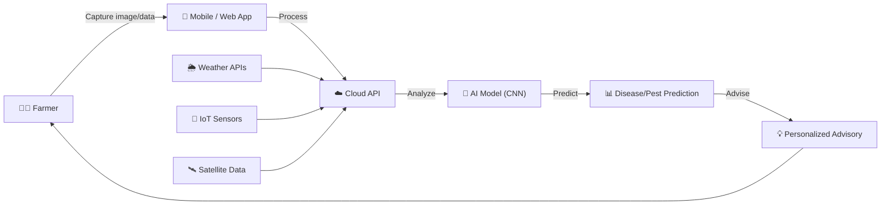

# 🌱 AgriVerse — Smart Pest & Disease Forecasting for Resilient Agriculture

> AI-driven pest & disease forecasting using weather, IoT, and remote sensing for early detection, precision management, and sustainable crop protection.

**Built for:** Pune Agri Hackathon 2026
**Problem Statement:** Plant Protection — Pest and Disease Forecasting & Management
**Team:** AgriVerse

---

## 📖 Table of Contents

- [Overview](#-overview)
- [The Problem](#-the-problem)
- [Our Solution](#-our-solution)
- [Technical Approach](#-technical-approach)
- [System Architecture](#-system-architecture)
- [Expected Performance & Impact](#-expected-performance--impact)
- [Feasibility & Viability](#-feasibility--viability)
- [Cost Estimation](#-cost-estimation)
- [Competitive Landscape](#-competitive-landscape)
- [Impact & Benefits](#-impact--benefits)
- [Research & References](#-research--references)
- [Team](#-team)
- [Documentation](#-documentation)

---

## 🔎 Overview

Traditional farming relies on **reactive** pest and disease management — by the time a farmer spots the problem, crop damage has already begun. AgriVerse flips this model by fusing **image-based AI, IoT sensor data, weather history, and satellite feeds** into a single forecasting engine that warns farmers *before* an outbreak happens, not after.

Read the full narrative in [`docs/CASE_STUDY.md`](docs/CASE_STUDY.md).

## 🚨 The Problem

| Threat | Why it matters |
|---|---|
| 30–40% of crops are lost every year to pests & diseases | Direct hit to farmer income and food security |
| Farmers receive no early warning before outbreaks | Damage is discovered only after it's visible |
| Climate change makes pest attacks unpredictable | Historical patterns alone are no longer reliable |
| Excess pesticide use increases cost and damages soil | Blanket spraying instead of targeted treatment |
| No real-time forecasting tools exist at the farmer level | Advisory is generic, not location- or crop-stage-specific |

## ✅ Our Solution

| Threat | AgriVerse Solution |
|---|---|
| Crop losses from pests & diseases | AI-based early detection and prediction system for timely alerts |
| No early warning | Real-time mobile advisory alerts before pest spread |
| Unpredictable climate-driven outbreaks | Weather-integrated predictive forecasting models |
| Overuse of pesticides | Precision pesticide recommendation system |
| No farmer-level tools | Farmer-friendly digital decision-support platform |

**Core value proposition:** *Reducing crop losses through early detection and data-driven decision support.*

## 🧠 Technical Approach

| Layer | Stack |
|---|---|
| **AI / ML** | CNN-based crop disease classification model |
| **Backend** | Python + Node.js for API & model handling |
| **Database** | Cloud database for storage & real-time data |
| **Data Sources** | Weather APIs + IoT sensor integration |
| **Frontend** | Web interface for farmers (HTML, CSS, JavaScript) |
| **Core Tech** | AI + Cloud + Remote Sensing integration |

**Key features:** Disease Detection · Early Warning Alerts · Smart Treatment Advice · Weather Integration · Multi-language Support

## 🏗 System Architecture

Full technical breakdown in [`docs/ARCHITECTURE.md`](docs/ARCHITECTURE.md).

## 📈 Expected Performance & Impact

| Metric | Target |
|---|---|
| Estimated Accuracy | 90–95% |
| Precision | ~90% |
| Response Time | < 2s |
| Yield Improvement | +20–30% |
| Cost Reduction | −15–25% |
| Early Detection Window | 3–5 days ahead of outbreak |
| Scalability | 1,000+ users, 10+ crops |

## 🛡 Feasibility & Viability

- **Technical Feasibility** — software-level integration fusing image-based AI with real-time IoT sensor data and weather history.
- **Scalability & Data Integration** — mobile and web-based access across regions, pulling from satellite APIs and distributed IoT nodes.
- **Risk Mitigation** — algorithms designed to minimize false positives, validated against expert-verified data.
- **Optimized Performance** — mobile edge-AI capability for low-bandwidth environments using optimized TensorFlow Lite models.

**Present vs. Future-Proof model:**

| | Present-day limitation (e.g. Plantix-style) | AgriVerse — Future-Proof |
|---|---|---|
| Detection | Image-based only, reactive | Multi-modal fusion (image + IoT + satellite) |
| Connectivity | Internet mandatory (cloud-only) | Offline-first, edge AI |
| Timing | After infection | Predictive — before infection |
| Advisory | General | Location- & crop-stage-based |

## 💰 Cost Estimation

*(Unit big-organization estimate, in Lakhs INR)*

| Category | Cost (₹ Lakhs) | Share |
|---|---|---|
| Regulatory & IP Compliance | 95.21 | 28.8% |
| Infrastructure & Maintenance (Cloud, Satellite APIs, IoT fees) | 80.12 | 24.2% |
| AI R&D and Edge Deployment | 60.30 | 18.2% |
| Operations & Farmer Support | 45.10 | 13.6% |
| Farmer Training & Field Adoption | 30.15 | 9.1% |
| Field Data Collection & Annotation | 20.01 | 6.1% |

## 🌍 Competitive Landscape

Existing innovations referenced: **Plantix, Agrio, Climate FieldView.**
AgriVerse differentiates through multi-modal data fusion (image + IoT + weather + satellite), offline-first edge inference, and predictive (pre-infection) rather than reactive advisory.

## 🎯 Impact & Benefits

- **Enhanced Predictive Capabilities** — multi-modal AI (image + weather + soil + historical) for highly accurate forecasting.
- **Proactive Disease Management** — predicts infections before they occur.
- **IoT & Satellite Integration** — real-time sensor and satellite data for a holistic farm-level view.
- **Resource Optimization** — variable-rate pesticide application, reducing chemical use by >30%.
- **Offline-First** — works in low-connectivity rural areas with local edge processing.
- **Personalized Advisory** — location-specific and crop-stage-based guidance.
- **Scalable** — supports small-hold to large-scale farm operations.

## 📚 Research & References

| Reference | Link | Purpose |
|---|---|---|
| PlantVillage Dataset | https://www.kaggle.com/datasets/emmarex/plantdisease | Crop disease image dataset for model training |
| Kaggle Crop Datasets | https://www.kaggle.com/ | Additional datasets for training & testing |
| TensorFlow / OpenCV | https://www.tensorflow.org/ · https://opencv.org/ | Libraries for image processing & model development |
| Teachable Machine | https://teachablemachine.withgoogle.com/ | Rapid prototyping of image classification model |
| OpenWeatherMap API | https://openweathermap.org/api | Weather data for disease prediction & forecasting |
| FAO Reports | https://www.fao.org/home/en/ | Crop loss & agriculture statistics |

## 👥 Team — AgriVerse

| Name |
|---|
| Ankur Patil |
| Saujanya Gupta |
| Komal Patil |
| Pranjal Doifode |
| Rushal Shelke |

## 📄 Documentation

- [`docs/CASE_STUDY.md`](docs/CASE_STUDY.md) — full narrative write-up of the problem, approach, and outcomes
- [`docs/ARCHITECTURE.md`](docs/ARCHITECTURE.md) — detailed technical architecture and data flow

---

<i>Submitted to Pune Agri Hackathon 2026</i>

